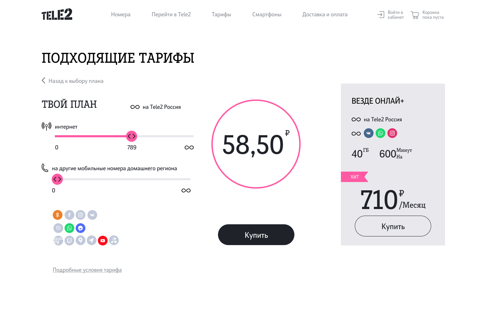

# Проект от ТЕЛЕ2

### Новый взгляд на макет конструктора тарифов

## Разработали дизайн и основуню идею проекта.

---

### Адаптивная веб-страничка - редизайн конструктора тарифов, содержащая, имитацию чат-бота, пмогающего подобрать необходимый тарифный план.
###

**Проект будет состоять из:**

- шапка сайта, блок _header_;
- основное содержимое страницы, блок _main_;
- подвал сайта, блок _footer_;
- блок _popup_, с чат-ботом.

---

Работа над проектом велась с использованием макета из графического редактора **_Figma_**.
