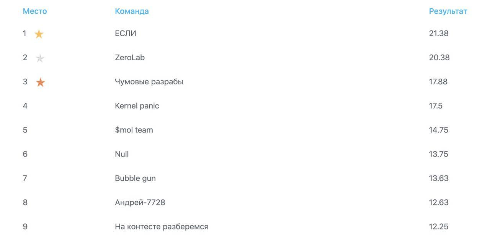
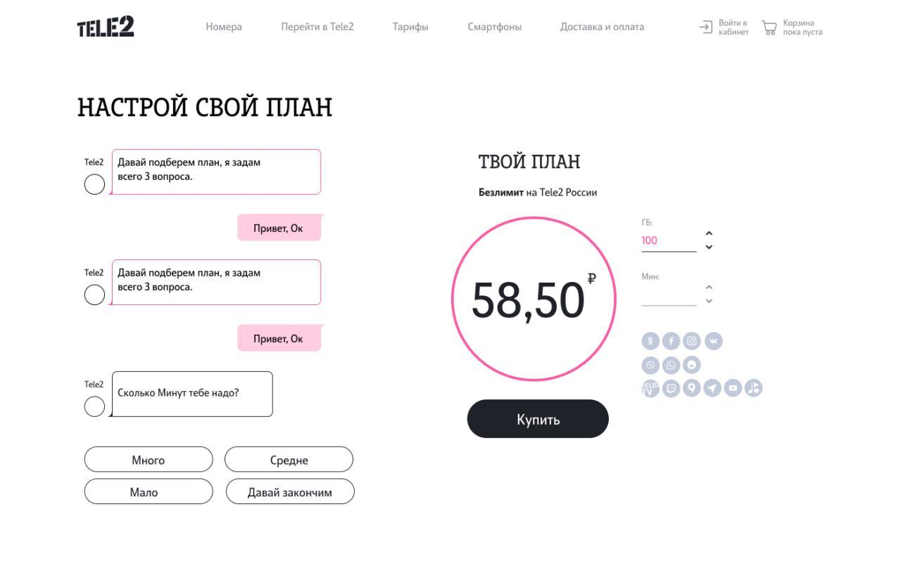
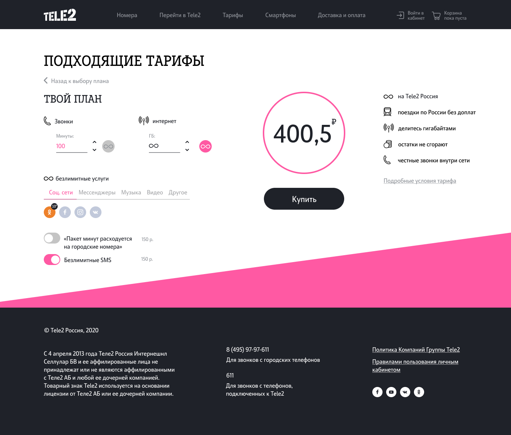
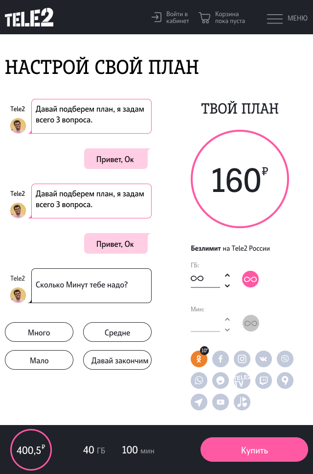
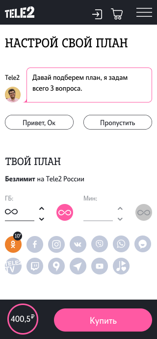

# Проект от ТЕЛЕ2

## Новый взгляд на макет конструктора тарифов
---

### Разработали основуню идею проекта, дизайн, сверстали дестктопную версию сайта и частично написали логику выбора тарифов.

---

### Веб-страничка - редизайн конструктора тарифов, содержащая, имитацию чат-бота, пмогающего подобрать необходимый тарифный план.
---
### [Конструктор тарифов](https://obitobi.github.io/tele2Hackathon/index.html)

Данный проект был выполнен в рамках хакатона от ТЕЛЕ2, с 21 по 23 августа, конмандой **"Чумовые разрабы"**.

В результате хакатона, в номинации "Редизайн тариф-конструктора", команда заняла 3 место среди 10 участников. Результаты будут выложены позже или их можно уточнить у организаторов.ы :

### **Дизайн основных страничек:**

- страничка с чат-ботом:

- основная страничка:

- версия на планшет:

- мобильная версия:

**Проект будет состоит из:**

- две адаптивныые веб-странички:
  - страничка с имитацией чат-бота;
  - страничка с тонкой настройкой тарифа;
- на каждой странице присутствует:
  - шапка сайта, блок _header_;
  - основное содержимое страницы, блок _main_;
  - подвал сайта, блок _footer_;

**Используемые технологии:**

- _flexbox_;
- _grid layout_;
- _font-face_ для подключения сторонних шрифтов;
- сглаживание шрифтов;
- псевдоклассы;
- дизайн ссылок;
- относительные величины;
- _медиазапросы_ для адаптации на разные экраны;
- относительное и абсолютное позиционировани;
- логика страничек реализована на языке **_JavaScript_**:
  - метод _querySelector_;
  - метод _addEventListener_;
  - свойство _value_;
  - написание дополнительных функций-обработчиков;
  - стрелочные функции;
  - объект _event_ и цель события _target_;
  - обход массивов, используя методы _foEach_ и _map_;
  - cсоздание элементов в _DOM_ из _JS_;
---

**Планы по доработке:**

- донаписать медиазапросы и сделать веб-страничку адаптивной;
- дописать логику выбора тарифов;
- собрать проект с помощью webpack;
- отсортировать по методолгии _БЭМ_.
---

Работа над проектом велась с использованием макета из графического редактора **_Figma_**.

